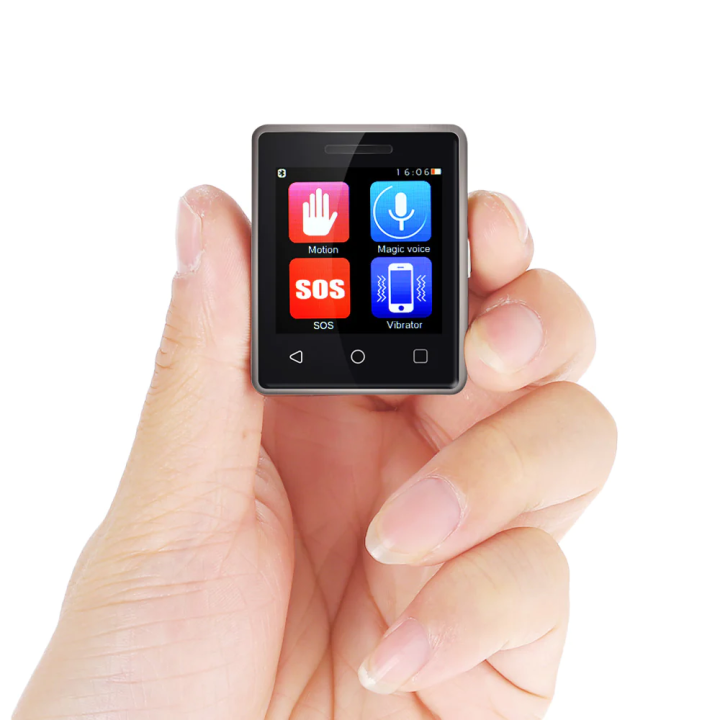
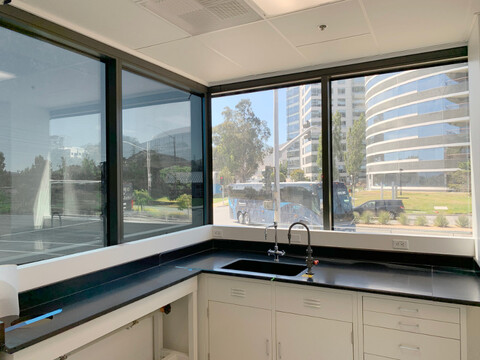

# Delievery door   :truck::
1. Camera will detect delivery drivers, and send a message to your phone. 
1. the ability to interact with the dilvery person with a small touch screen device installed, after sending the user alerts.
1.  the user then will deside what action might happen, if they want to open the door.

# Smart Window  :window: :
1. connect the camera to local weather conditions, based on the weather it will do certian action, such as closing the windows if it was rainy or humid or opening it for vantilation. 
1. connect to an inisde Thermostat and give the user the ability to control the weather at home maybe by contronlling opening or shutting the windows slighlity.

# Air Vendy  :robot: : 
1. an App that is connect to a vending machine in aircarfts, allowing you to order without having to call the flight attendnce.

